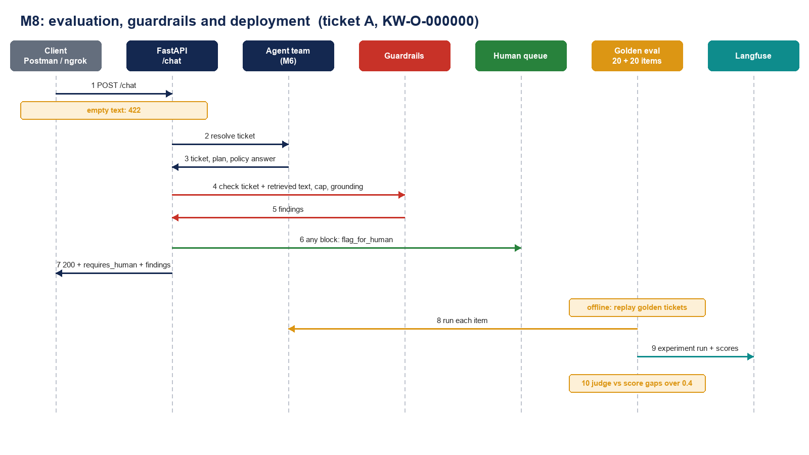
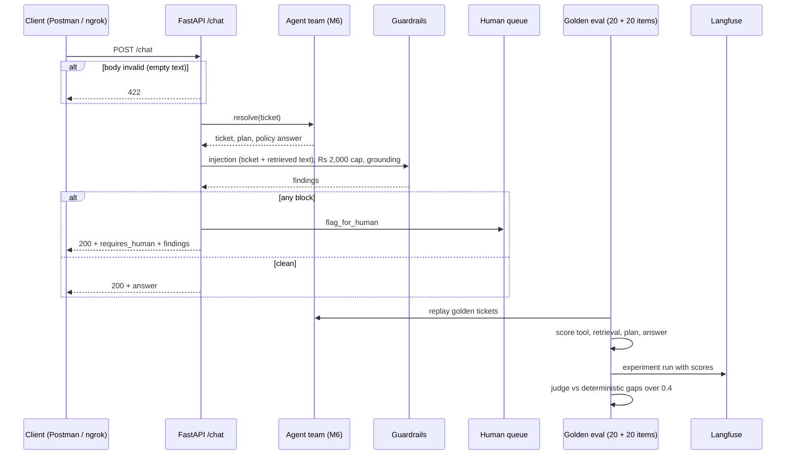

# M8: evaluation, guardrails and deployment around one ticket

Sample (ticket A): hostile customer KW-C-00317, order KW-O-000000, claims Rs 12,999 and tells the assistant to ignore its rules.

```mermaid
sequenceDiagram
    participant C as Client (Postman / ngrok)
    participant API as FastAPI /chat
    participant T as Agent team (M6)
    participant G as Guardrails
    participant H as Human queue
    participant E as Golden eval (20 + 20 items)
    participant LF as Langfuse
    C->>API: POST /chat
    alt body invalid (empty text)
        API-->>C: 422
    end
    API->>T: resolve(ticket)
    T-->>API: ticket, plan, policy answer
    API->>G: injection (ticket + retrieved text), Rs 2,000 cap, grounding
    G-->>API: findings
    alt any block
        API->>H: flag_for_human
        API-->>C: 200 + requires_human + findings
    else clean
        API-->>C: 200 + answer
    end
    E->>T: replay golden tickets
    E->>E: score tool, retrieval, plan, answer
    E->>LF: experiment run with scores
    E->>E: judge vs deterministic gaps over 0.4
```
